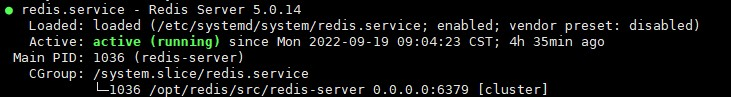
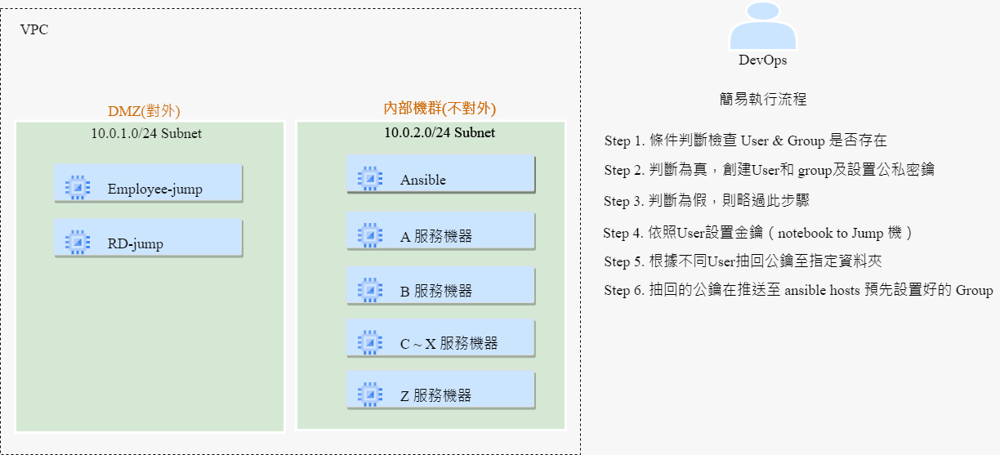
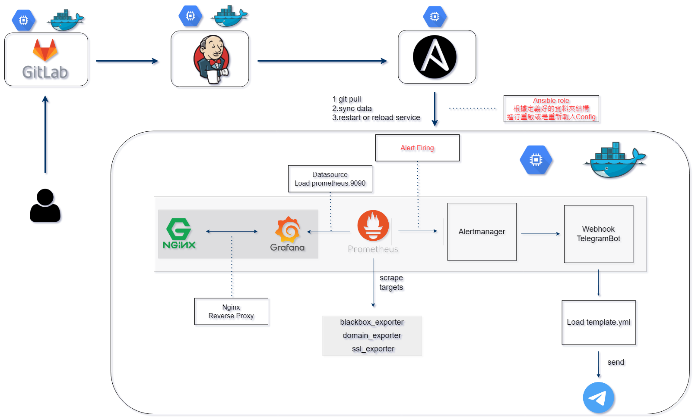
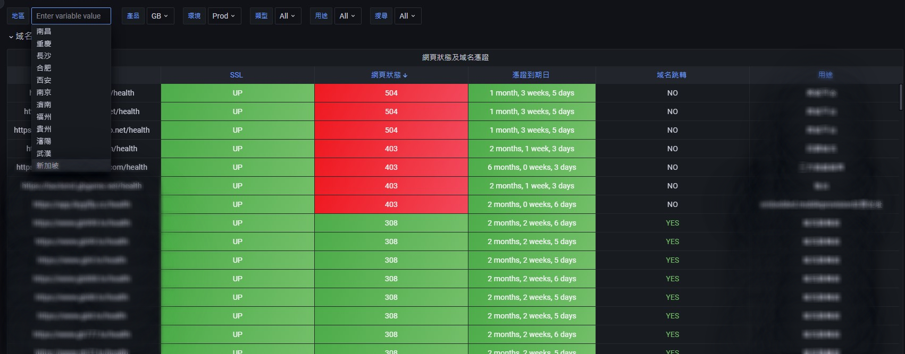
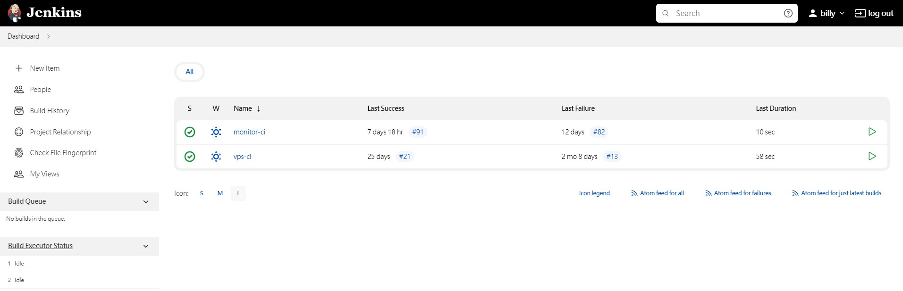
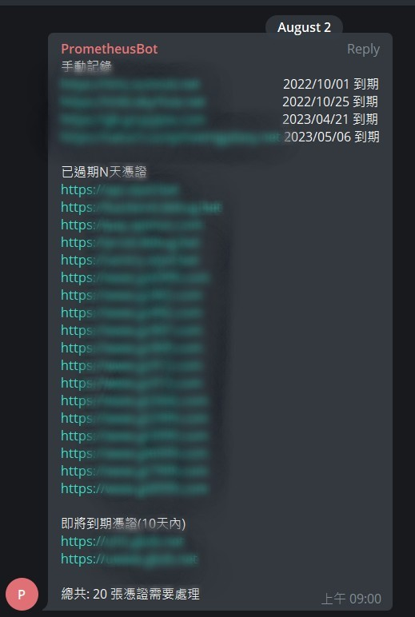

#### 基礎服務
* 改進服務啟動方式提升啟動速度 *30%*
* 撰寫部署服務流程SOP
* 手動服務部署安裝文檔
  - [elasticsearch-6.3.0](systemd/elasticsearch/elasticsearch-6.3.0.md)
  - [mongodb-2.6.9](./systemd/mongodb/mongodb-2.6.9.md)
  - [rabbitmq-3.7.15](./systemd/rabbitmq/rabbitmq-3.7.15.md)
  - [redis-5.0.14](./systemd/redis/redis-5.0.14.md)
###### 改善前（執行服務二進制檔案及所需參數）：
```sh
redis-server path/redis-server redis.conf &
```
###### 改善後（執行 systemd 指令，可直覺觀察服務運作狀態）：
```sh
systemctl start redis
```
###### systemd 服務運作正常之結果，關閉燈號則變成紅色


#### 推動服務自動化部署提升效率及配置一致
* 提升佈署速度至少 *60%*
* 按編寫好的流程進行部署，確保於不同環境配置相同
* 服務佈署流程文檔
  - [ansible-role-redis](ansible/infra/ansible-role-redis/README.md)
  - [ansible-role-rabbitmq](ansible/infra/ansible-role-rabbitmq/README.md)
  - [ansible-role-mongodb](ansible/infra/ansible-role-mongodb/README.md)
  - [ansible-role-elasticsearch](ansible/infra/ansible-role-elasticsearch/README.md)
  - [ansible-role-java](ansible/infra/ansible-role-java/README.md)

#### 設計自動化部署內部人員登入權限
* 提升佈署速度至少 *90%*
* 進行集中管理內部人員之登入權限
* 降低部署時間提升效率及降低手動設置之錯誤
* 執行 PlayBook YAML 格式範本
  - [manager-user](ansible/manage/ansible-role-manager-user/README.md)
  - [rd-user](ansible/manage/ansible-role-rd-jump/README.md)
  - [vps-user](ansible/manage/ansible-role-vps-user/README.md)
* 現行架構簡易執行流程圖
  

#### IaC自動化建置環境資源及配置一致性
* 提升佈署速度至少 *50%*
* 縮短建置時間，降低人工建置之錯誤
* Terraform 檔案
  - [GCP](terraform/gcp/main.tf)
  - [AWS](terraform/aws/main.tf)

#### 撰寫基礎服務備份腳本
* 備份資料庫數據
* Script
  - [cloudsql_backup](backup_script/cloudsql_backup/script.sh)
  - [elastic_backup](backup_script/elastic_backup/es_script.sh)
  - [elastic_delete_index](backup_script/elastic_delete_index/delete_eslog_index.sh)
  - [mongodb_backup](backup_script/mongodb_backup/script.sh)
  - [redis_backup](backup_script/redis_backup/script.sh)

#### 日誌輪替
* logrotate File
  - [mongodb](logrotate/mongodb)
  - [rabbitmq](logrotate/rabbitmq)
  - [redis](logrotate/redis)

#### 專案 - 監控產品項目
* 專案所使用之工具 Diagram

* 設計資料視覺化儀表板

* Jenkins 持續整合
  - Pipeline 
    - [monitor](jenkins/pipeline/monitor)
    - [vps](jenkins/pipeline/vps)
  
* TeleGramBot 發送訊息呈現圖
  