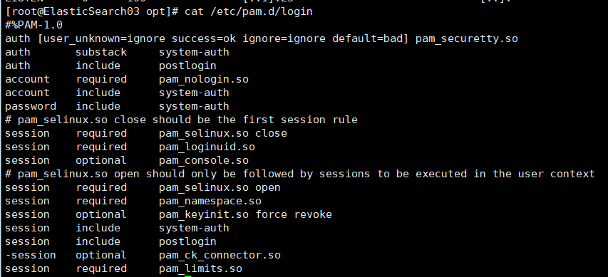
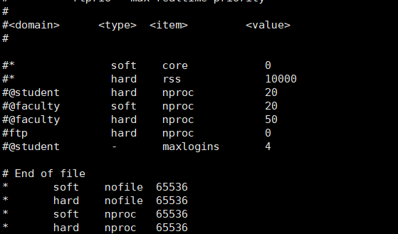
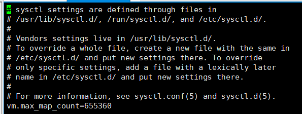

elasticsearch-6.3.0 (Cluster)

佈署及操作都需使用 root user

### Java-install
```shell
tar -xaf jdk1.8.0_161.tar

echo 'JAVA_HOME=/opt/jdk1.8.0_161/bin' >> /etc/bashrc
echo 'export PATH=$PATH:$JAVA_HOME' >> /etc/bashrc
source /etc/bashrc
```

### Elasticsearch-install
```shell
# For google cloud platform
groupadd elasticsearch
useradd -m -g elasticsearch -G google-sudoers elasticsearch

(需與HOSTNAME同名)
vi /etc/hosts
IP  HostName01
IP  HostName02
IP  HostName03

tar xaf elasticsearch-6.3.0.tar.gz
mv /opt/elasticsearch-6.3.0 /opt/elasticsearch

mkdir /opt/elasticsearch/pid
mkdir /opt/elasticsearch/data
```

### Configure
```shell
mv ./elasticsearch.service.txt /etc/systemd/system/elasticsearch.service
mv ./elasticsearch.sysconfig.txt /etc/sysconfig/elasticsearch
mv ./elasticsearch.yml.txt /opt/elasticsearch/config/elasticsearch.yml

vi /opt/elasticsearch/config/elasticsearch.yml

需修改兩個地方；
# 名稱不能與其他節點重複，可設成該台的 HostName 
1. node.name: ""

# HostNamexx 更改為其餘節點的 HostName
2. discovery.zen.ping.unicast.hosts: ["HostName01", "HostName02", "HostName03"]

chown -R elasticsearch:elasticsearch /opt/elasticsearch

chown root:root /etc/systemd/system/elasticsearch.service
chown root:root /etc/sysconfig/elasticsearch

chmod 0644 /etc/systemd/system/elasticsearch.service
chmod 0660 /etc/systemd/system/elasticsearch.service

# jvm_options 根據硬體配置去設定
# -Xms1g
# -Xmx1g
```

### 確保 limit.conf 運作
```
echo 'session    required     pam_limits.so' >> /etc/pam.d/login
```


### vi /etc/security/limits.conf
```
*	soft	nofile	65536
*	hard	nofile	65536
*	soft	nproc	65536
*	hard	nproc	65536
```


### vi /etc/sysctl.conf
```
echo 'vm.max_map_count=655360' >> /etc/sysctl.conf && sysctl -p
```


### 啟動服務
```
systemctl start elasticsearch && systemctl enable elasticsearch
```

### Check
```shell
curl localhost:9200/_cat/nodes?pretty
curl localhost:9200/_cat/health?pretty
curl localhost:9200/_cat/recovery?pretty
curl localhost:9200/_cluster/health?pretty
```