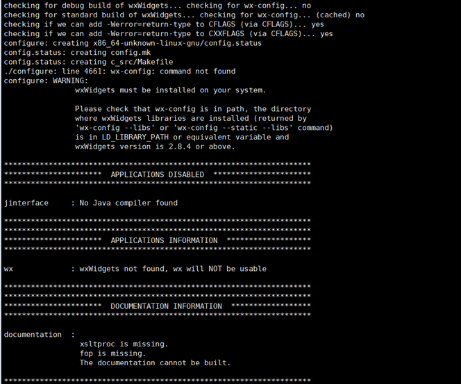

RabbitMQ-3.7.15 (Cluster)

佈署及操作都需使用 root user

### Erlang-install
```shell
yum install -y epel-release gcc perl make ncurses-devel openssl openssl-devel unixODBC unixODBC-devel mesa*

tar xaf otp_src_22.0.tar.gz

cd /opt/otp_src_22.0
./configure --prefix=/opt/erlang
make && make install
```
### './configure --prefix=/opt/erlang' 出現這畫面不影響後續佈署


### Rabbitmq-install
```shell
(需與HOSTNAME同名)
vi /etc/hosts
IP  HostName01
IP  HostName02
IP  HostName03

tar xaf rabbitmq-server-generic-unix-3.7.15.tar.xz
mv /opt/rabbitmq_server-3.7.15 /opt/rabbitmq

mkdir /opt/rabbitmq/pid
mkdir /opt/rabbitmq/logs
```

### Configure
```shell
vi /etc/bashrc
ERLANG_BIN=/opt/erlang/bin
RABBITMQ_BIN=/opt/rabbitmq/sbin
export PATH=$PATH:$ERLANG_BIN:$RABBITMQ_BIN
source /etc/bashrc

ln -s /opt/erlang/bin/erl /usr/bin/erl

# conf/service 設定檔請複製貼上，不然會有問題
vi /opt/rabbitmq/etc/rabbitmq/rabbitmq-env.conf
vi /etc/systemd/system/rabbitmq.service

chmod 0644 /opt/rabbitmq/etc/rabbitmq/rabbitmq-env.conf
chmod 0644 /etc/systemd/system/rabbitmq.service

# 啟用 Web Plugin
rabbitmq-plugins enable rabbitmq_management

# 複製 主節點 '/root/.erlang.cookie'值 貼至 其他節點 相同位置
rm -f /root/.erlang.cookie 
vi /root/.erlang.cookie
chmod 0400 /root/.erlang.cookie

# 啟動服務
systemctl start rabbitmq && systemctl enable rabbitmq
```

### Make cluster
```shell
# 在其他節點執行即可
rabbitmqctl stop_app
rabbitmqctl reset
rabbitmqctl stop_app
rabbitmqctl join_cluster rabbitmq@<Master HostName>
start_app
```

### Add web user
```shell
# 在主節點執行即可
rabbitmqctl add_user global password
rabbitmqctl set_permissions -p / global . . .
rabbitmqctl set_user_tags global administrator
```

### Check
```shell
rabbitmqctl status
rabbitmqctl cluster_status
```